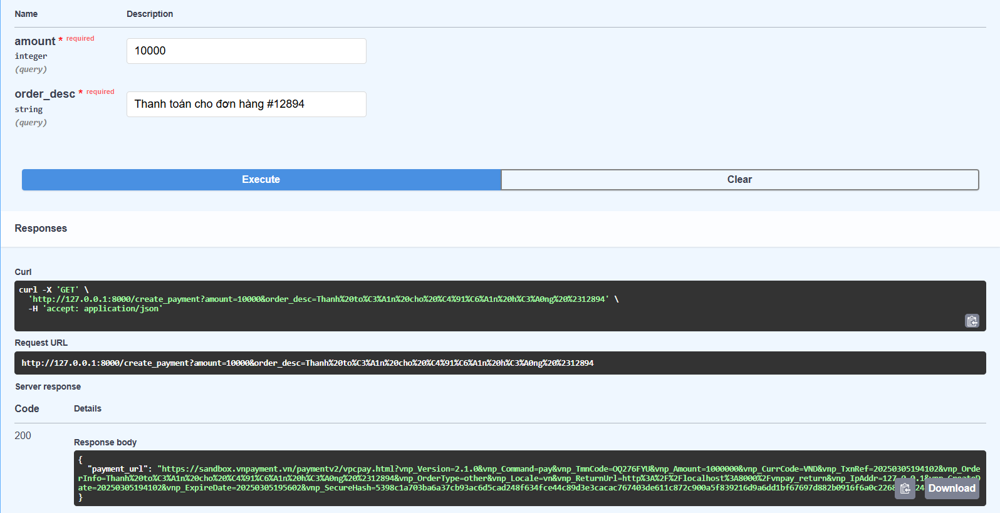
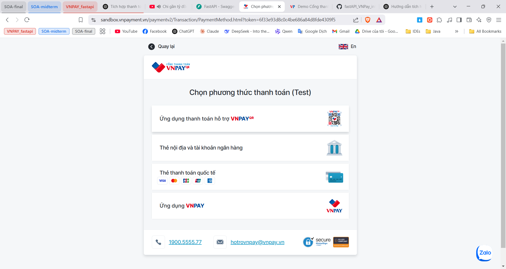
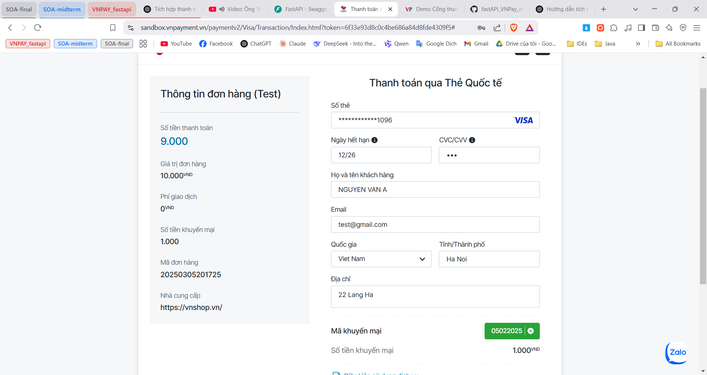
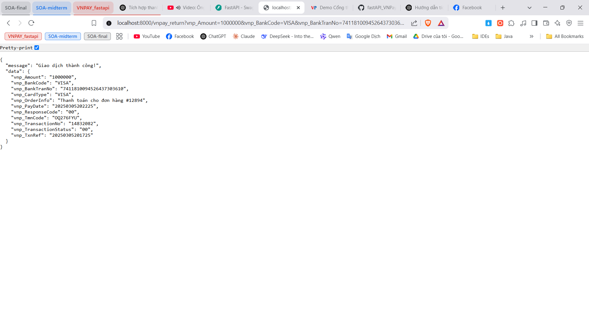

# FastAPI VNPAY Integration

## Description
This project integrates VNPAY with FastAPI to handle online payments.

## Installation Guide
1. Install Python 3.9+.
2. Create a virtual environment:
   ```sh
   python -m venv venv
   source venv/bin/activate  # On macOS/Linux
   venv\Scripts\activate  # On Windows
   ```
3. Install required dependencies:
   ```sh
   pip install -r requirements.txt
   ```
4. Set up the `.env` file:
   ```env
   VNPAY_URL=<VNPAY URL>
   VNPAY_TMN_CODE=<TMN Code>
   VNPAY_HASH_SECRET=<Secret Key>
   VNPAY_RETURN_URL=<Callback URL>
   ```
5. Run the application with FastAPI:
   ```sh
   uvicorn main:app --reload
   ```

## How to Create a VNPAY Account (Sandbox)

**Access the VNPAY Sandbox Page**

1. Register an account by providing your **email** and necessary details.
2. After successful registration, you will receive the required credentials:
   - **vnp_TmnCode**: Test merchant site code.
   - **vnp_HashSecret**: Secret key for data encryption.
   - **API Endpoint**: Test payment API endpoint.

## API Endpoints
- `GET /create_payment?amount=100000&order_desc=Order Payment`
- `GET /vnpay_return` - Receive transaction results from VNPAY

## Workflow Diagram


## Test Results

**Request Payment**



**Server redirects to VNPAY's payment URL**



**Enter Card Information**

[Link: Test Payment Account](https://sandbox.vnpayment.vn/apis/vnpay-demo/)



**Payment Result**

*Modify the logic to match your application needs*



## Notes
If you encounter any issues, feel free to reach out for support!

