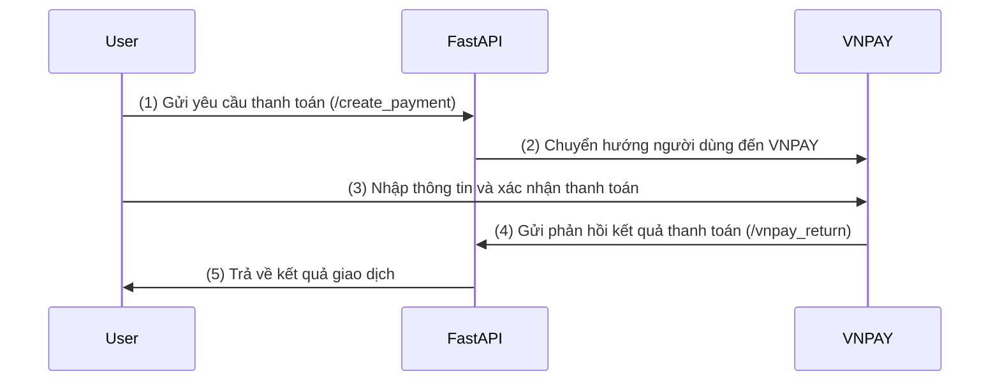

# FastAPI VNPAY Integration

## Mô tả
Ứng dụng này tích hợp VNPAY với FastAPI để tạo thanh toán và xử lý phản hồi từ VNPAY.

## Cài đặt
1. Cài đặt các thư viện cần thiết:
   ```sh
   pip install fastapi uvicorn python-dotenv
   ```
2. Tạo file `.env` và điền các thông tin cấu hình:
   ```env
   VNPAY_URL=<URL CỦA VNPAY>
   VNPAY_TMN_CODE=<MÃ TMN>
   VNPAY_HASH_SECRET=<MẬT KHẨU BÍ MẬT>
   VNPAY_RETURN_URL=<URL TRẢ VỀ>
   ```
3. Chạy ứng dụng với lệnh:
   ```sh
   uvicorn main:app --reload
   ```

## API Endpoints
- `GET /create_payment?amount=<int>&order_desc=<str>`
  - Tạo URL thanh toán với VNPAY.
- `GET /vnpay_return`
  - Xử lý phản hồi từ VNPAY.

## Sơ đồ luồng hoạt động


## Ghi chú
- `vnp_SecureHash` được sử dụng để xác minh tính hợp lệ của giao dịch.
- Chữ ký được tạo bằng thuật toán HMAC SHA512.

## Liên hệ
Nếu có vấn đề, vui lòng liên hệ để được hỗ trợ.

