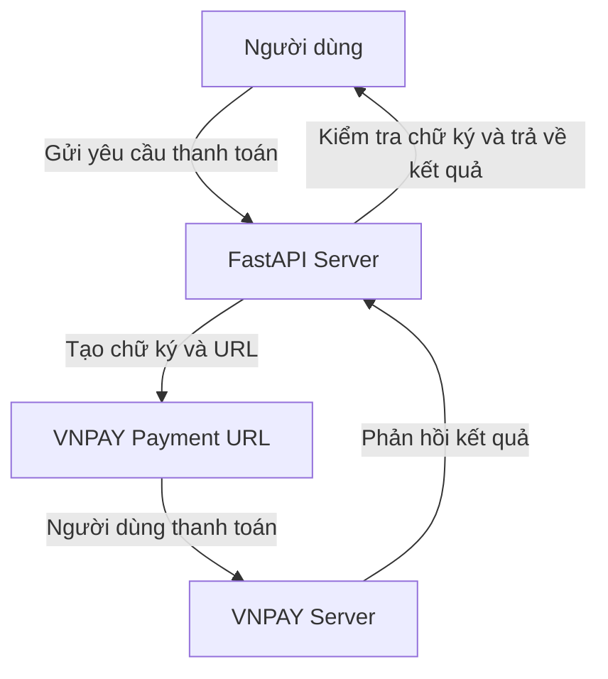

# FastAPI VNPAY Integration

## Giới thiệu
Dự án này tích hợp VNPAY vào FastAPI để hỗ trợ thanh toán trực tuyến.

## Cài đặt
1. Cài đặt các thư viện cần thiết:
   ```sh
   pip install fastapi uvicorn python-dotenv
   ```
2. Tạo tệp `.env` và thêm thông tin cấu hình:
   ```env
   VNPAY_URL=<URL_CUA_VNPAY>
   VNPAY_TMN_CODE=<MA_TMN>
   VNPAY_HASH_SECRET=<CHUOI_BI_MAT>
   VNPAY_RETURN_URL=<URL_TRA_VE>
   ```

## Khởi chạy ứng dụng
Chạy lệnh sau để khởi động server với chế độ reload:
```sh
uvicorn main:app --reload
```

## API Endpoints
### 1. Tạo yêu cầu thanh toán
- **Endpoint:** `GET /create_payment`
- **Tham số:**
  - `amount`: Số tiền cần thanh toán (đơn vị VND)
  - `order_desc`: Mô tả đơn hàng
- **Response:** Trả về `payment_url` để chuyển hướng người dùng đến VNPAY.

### 2. Xử lý phản hồi từ VNPAY
- **Endpoint:** `GET /vnpay_return`
- **Mô tả:** Kiểm tra và xác thực chữ ký phản hồi từ VNPAY.
- **Response:**
  - Thành công: Trả về thông tin giao dịch.
  - Thất bại: Trả về lỗi tương ứng.

## Sơ đồ luồng hoạt động


## Ghi chú
- Đảm bảo môi trường `.env` chứa thông tin chính xác.
- Kiểm tra kết nối mạng khi gọi API VNPAY.
- Thử nghiệm với sandbox trước khi triển khai thực tế.

## License
MIT

