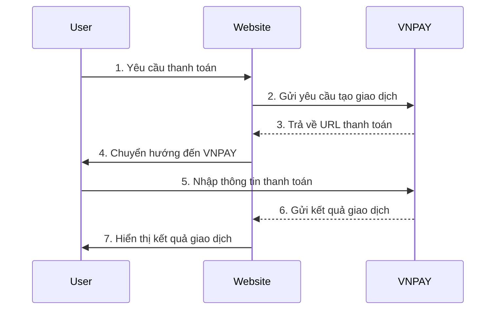
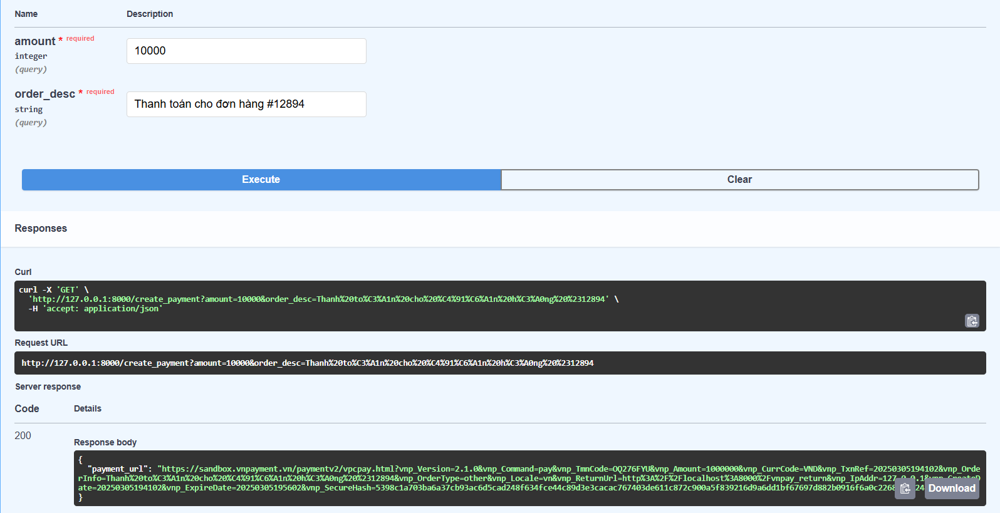
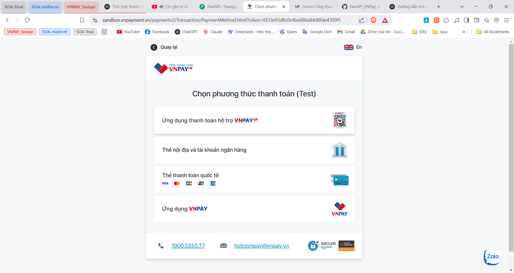
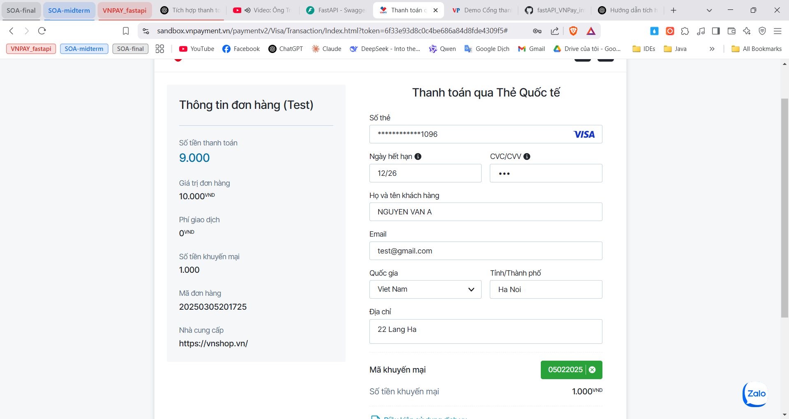
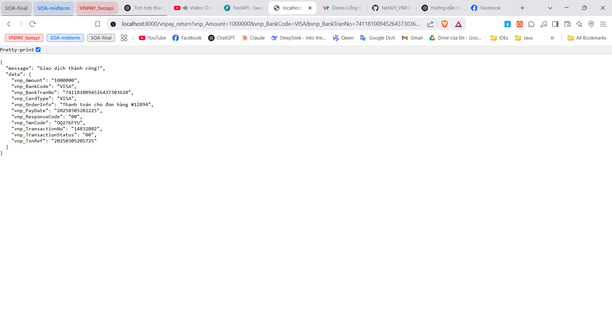

# FastAPI VNPAY Integration

## Mô tả
Dự án này tích hợp VNPAY vào FastAPI để xử lý thanh toán trực tuyến.

## Hướng dẫn cài đặt
1. Cài đặt Python 3.9+.
2. Tạo môi trường ảo:
   ```sh
   python -m venv venv
   source venv/bin/activate  # Trên macOS/Linux
   venv\\Scripts\\activate  # Trên Windows
   ```
3. Cài đặt các thư viện cần thiết:
   ```sh
   pip install -r requirements.txt
   ```
4. Thiết lập file `.env`:
   ```env
   VNPAY_URL=<URL VNPAY>
   VNPAY_TMN_CODE=<Mã TMN>
   VNPAY_HASH_SECRET=<Chuỗi bí mật>
   VNPAY_RETURN_URL=<URL callback>
   ```
5. Chạy ứng dụng với FastAPI:
   ```sh
   uvicorn main:app --reload
   ```

## Hướng dẫn tạo tài khoản VNPAY (Sandbox)

**Truy cập trang VNPAY Sandbox**

1. Đăng ký tài khoản bằng cách cung cấp **email** và thông tin cần thiết.
2. Sau khi đăng ký thành công, bạn sẽ nhận được các thông tin cần thiết:
   - **vnp_TmnCode**: Mã website thử nghiệm.
   - **vnp_HashSecret**: Chuỗi bí mật để mã hóa dữ liệu.
   - **API Endpoint**: Đường dẫn API thanh toán thử nghiệm.

## API Endpoints
- `GET /create_payment?amount=100000&order_desc=Thanh toan don hang`
- `GET /vnpay_return` - Nhận kết quả giao dịch từ VNPAY

## Sơ đồ luồng hoạt động


## Kết quả kiểm thử

**Gửi yêu cầu thanh toán**



**Server chuyển hướng đến URL của VNPAY**



**Điền thông tin thẻ**

[Link: Tài khoản để test chức năng thanh toán](https://sandbox.vnpayment.vn/apis/vnpay-demo/)



**Kết quả thanh toán**

*Hãy sửa lại logic để phù hợp với app của bạn*



## Ghi chú
Nếu có bất kỳ vấn đề nào, vui lòng liên hệ để được hỗ trợ!

